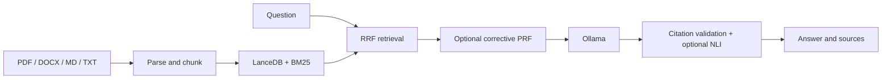
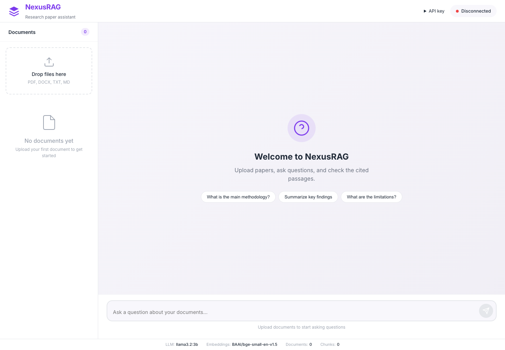
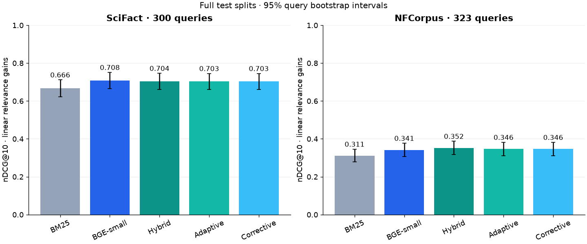
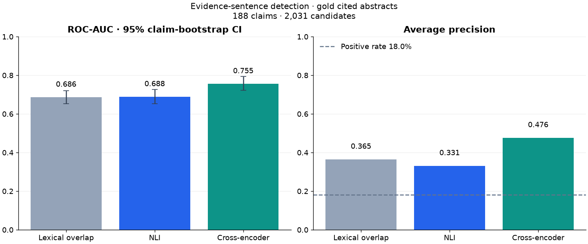

# NexusRAG

## Overview

Search research papers with dense embeddings and BM25. Ask Ollama for cited answers; inspect the retrieved passages.

## Data flow

## Results

**Full BEIR test splits · nDCG@10 · higher is better**

| System | SciFact · 300 queries | [NFCorpus](https://www.cl.uni-heidelberg.de/statnlpgroup/nfcorpus/) · 323 queries |
| --- | ---: | ---: |
| Dense · MiniLM | 0.648 | 0.318 |
| BM25 | 0.666 | 0.311 |
| Dense · BGE-small | 0.708 | 0.341 |
| Hybrid · RRF | 0.704 | 0.352 |
| + Adaptive weights | 0.703 | 0.346 |
| + Corrective PRF | 0.703 | 0.346 |

**Observed retrieval cost** · first **120 SciFact queries**, one CPU pass; initial reranker loading included. Reranking is off by default.

| System | nDCG@10 | ms/query |
| --- | ---: | ---: |
| Adaptive | 0.734 | 16.9 |
| Corrective PRF | 0.734 | 17.3 |
| Rerank (cross-enc) | 0.702 | 1318.9 |

**Evidence-sentence detection** · 188 SciFact dev claims · 2,031 candidates · 18.0% positive.

| Scorer | ROC-AUC | Average precision | F1 |
| --- | ---: | ---: | ---: |
| Lexical overlap | 0.686 | 0.365 | 0.112 |
| NLI | 0.688 | 0.331 | 0.368 |
| Cross-encoder | 0.755 | 0.476 | 0.469 |

This task identifies supporting **or contradicting** rationale sentences in annotated abstracts. It does not measure generated-answer accuracy.

### Protocol & provenance

1. Exact CPU search; seed **0**; RRF **k=60**; depth **50**; linear nDCG gains; **5,183 / 3,633** documents.
2. Retrieval: **10,000** query bootstrap samples and paired randomizations; Holm correction per dataset. Evidence: **2,000** claim bootstraps.
3. Headline PRF uses **τ=0.55**; separate SciFact tuning uses **250 train queries**. Evidence thresholds use **120 train claims**. [Raw results](outputs/results) record revisions, source hashes, runtime versions and individual scores.

## Architecture

| Stage | Implementation |
| --- | --- |
| Ingest | Section-aware chunks: **1,200 characters**, **300 overlap**; metadata and context retained |
| Retrieve | Exact LanceDB cosine + in-memory BM25; weighted RRF; one corrective pass below **0.55** dense similarity |
| Generate | Ollama **llama3.2:3b**; invalid citation indices removed; sentence grounding optional |
| Serve | FastAPI API + packaged web UI; one worker; optional API-key authentication, upload guards and rate limits |

Library helper: [`DenseRetriever.retrieve_with_threshold`](src/scinexusrag/retrieval/dense.py#L45) filters the top-k dense matches by `min_score` (default **0.3**).

## Tech stack

| Layer | Tools |
| --- | --- |
| Language / API | Python **3.11+**, FastAPI, Uvicorn |
| Retrieval | BGE-small, sentence-transformers, LanceDB, PyArrow, rank-bm25 |
| Generation / grounding | Ollama, httpx, DeBERTa NLI |
| Interface | HTML, CSS, JavaScript |
| Evaluation | BEIR, SciFact, NumPy, SciPy, Matplotlib |

[Setup, configuration and checks](CONTRIBUTING.md) · [Notebook](notebooks/01_quickstart.ipynb) · [Examples](examples)

## Limitations

1. Abstract-level benchmarks do not establish full-paper answer accuracy or citation correctness.
2. Exact vector search scales linearly; BM25 rebuilds in memory and requires one application worker.
3. Corrective retrieval can reduce ranking quality; NLI is a model estimate. Ollama tags can change.

## Future work

1. Evaluate full-paper questions and human-reviewed answers.
2. Add a shared persistent sparse index and bounded request concurrency.
3. Repeat latency measurements with warmup and confidence intervals.

## Ethics & data use

1. Process documents you have permission to use; restrict sensitive uploads.
2. Keep Ollama local for local processing; review answers against their sources.
3. Respect dataset and model terms; the repository license applies to its code.

## References

1. [Lewis et al. · Retrieval-Augmented Generation · NeurIPS 2020](https://proceedings.nips.cc/paper/2020/hash/6b493230205f780e1bc26945df7481e5-Abstract.html)
2. [Thakur et al. · BEIR · NeurIPS 2021](https://datasets-benchmarks-proceedings.neurips.cc/paper_files/paper/2021/hash/65b9eea6e1cc6bb9f0cd2a47751a186f-Abstract-round2.html)
3. [Cormack et al. · Reciprocal Rank Fusion · SIGIR 2009](https://doi.org/10.1145/1571941.1572114)
4. [Wadden et al. · SciFact · EMNLP 2020](https://aclanthology.org/2020.emnlp-main.609/)

[MIT License](LICENSE)
